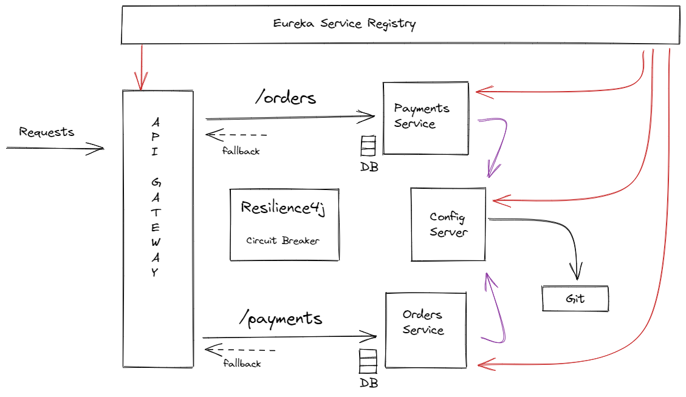

# Orders and Payments Microservices Simulation



This project simulates the working of microservices where two microservies, the Orders and the Payments communicates with each other and other services that make their communication possible, like API Gateway, Service Discovery, Centralized configuration, fault tolerance via circuit breaker pattern are microservices themselves.

<br>

## 1) API Gateway

This microservie is the entrypoint of all the incoming requests to the system. It routes the requests to respective microservices based on the route configurations in the configuration file.
<br><br>
This is implemented using the <strong>Spring Cloud Gateway</strong>
<br>
(Docs) https://cloud.spring.io/spring-cloud-gateway/reference/html/
<br>
<hr>

## 2) Discovery Server

This microservice acts as a registry server where all other microservices in the system acts as clients and registers themselves with the discovery server. Any microservice willing to communicate with any other service simply references the Discovery server which contains metadata about the other services
<br><br>
This is implemented using the <strong>Eureka Service Registry and Discovery</strong>
<br>
(Docs) https://spring.io/guides/gs/service-registration-and-discovery/
<br>
<hr>

## 3) Orders Service

This microservice exposes an endpoint to consume request for placing an order. It recieves the order details and calls the payment microservice for making the payment before successfully placing the order. 
<br>
For simlulation purpose, the database chosen is the H2 in-memory database for storing the placed order after successful payment. In case of any failure, the fallback mechanism sends the appropriate response.
<br><hr>

## 4) Payments Service

This microservice exposes 2 endpoints. One endpoint is to make payment for particular order and other to retrieve the payment details for particular order. The payment and order entities share a one-to-one mapping.
<br>
For simlulation purpose, the database chosen is the H2 in-memory database for storing the placed order after successful payment. In case of any failure, the fallback mechanism sends the appropriate response.
<br><hr>

## 5) Fallback Mechanism (Hystrix and Resilience4j)

In case of any exception or error thrown by any microservice, instead of whole system going down, a fallback mechanism returns a default message for that particular microservice. The microservice which generated the error is taken down temporarily from the system. This is the circuit breaker design pattern to achieve fault tolerance.
<br><br>
Its is achieved using <strong>Hystrix</strong>
<br>
DOCS https://github.com/Netflix/Hystrix
<br>
and Resilience4j
<br>
DOCS https://resilience4j.readme.io/docs
<br><hr>

## 6) Centralized Configuration

A lot of common configuration is shared by a lot of microservices, so instead of each microservice maintain them individually, we place the configurations in a remote repository and establish a config server which directly consumes from the repository. All the other microservice in the system then can contact the config server for the configuraions. This way, we can change the configurations without the need to restart the system. This the called centralizing the configuration for microservices.
<br><br>
This is imlemented using <strong>Spring Cloud Config</strong>
<br>
DOCS https://cloud.spring.io/spring-cloud-config/reference/html/
<br>
<hr>
<br>

# How to set up the microservices locally

Each microservice is a seperate Spring Boot Application. We can use maven to run them. 

For each microservice, 

<strong>Step 1</strong><br> Run
```
mvn install
```
for each service to build the jar files.<br>

<strong>Step 2</strong> <br> For each service, run 
```
java -jar target\<jar-name>
```

in the following order (since some service need discovery server and configuration server setup beforehand)
1) service-registry
2) config-server
3) cloud-gateway
4) order-service
5) payment-service


